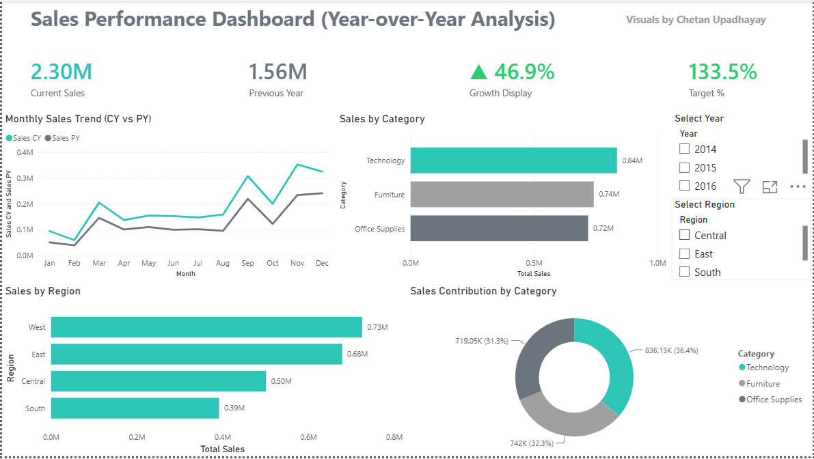

# 📈 Sales Performance Dashboard — Year-over-Year Analysis

Interactive Power BI dashboard analyzing **US Superstore sales performance** with year-over-year comparison across categories, regions, and time periods.

---

## 📊 Dashboard Preview

> *Visuals by Chetan Upadhyay*

---

## 🎯 Business Questions Answered

- How does current year sales compare to previous year?
- Are we meeting our sales target?
- Which product categories drive the most revenue?
- Which regions perform best?
- How does monthly sales trend look CY vs PY?
- What is the sales contribution of each category?

---

## 🛠️ Tools & Technologies

| Tool | Purpose |
|------|---------|
| Excel | Data cleaning and exploratory analysis |
| Power BI | Interactive dashboard and YoY analysis |

---

## 📦 Dataset

- **Source:** [Kaggle — Superstore Sales Dataset](https://www.kaggle.com/datasets/vivek468/superstore-dataset-final)
- **Period:** 2014 – 2017
- **Records:** 9,994 orders
- **Coverage:** US retail sales across Furniture, Technology, Office Supplies

---

## 📈 Key Metrics

| KPI | Value |
|-----|-------|
| Current Year Sales | $2.30M |
| Previous Year Sales | $1.56M |
| YoY Growth | ▲ 46.9% |
| Target Achievement | 133.5% |

---

## 🔍 Key Insights

- 📈 **Strong Growth:** 46.9% YoY growth — current year significantly outperformed previous year
- 🎯 **Target Exceeded:** 133.5% of target achieved — exceptional performance
- 💻 **Top Category:** Technology leads with $0.84M in sales (36.4% contribution)
- 🪑 **Second:** Furniture at $0.74M (32.3% contribution)
- 📦 **Third:** Office Supplies at $0.72M (31.3% contribution)
- 🌎 **Top Region:** West — $0.73M total sales
- 📉 **Lowest Region:** South — $0.39M total sales
- 📅 **Peak Month:** November — highest sales spike visible in trend

---

## 📊 Dashboard Visuals

| Visual | Description |
|--------|-------------|
| KPI Cards | Current Sales, Previous Year, Growth %, Target % |
| Line Chart | Monthly Sales Trend — CY vs PY comparison |
| Bar Chart | Sales by Category (Technology, Furniture, Office Supplies) |
| Bar Chart | Sales by Region (West, East, Central, South) |
| Donut Chart | Sales Contribution % by Category |
| Slicers | Filter by Year (2014–2016), Region |

---

## 📋 Key Dataset Columns

| Column | Description |
|--------|-------------|
| Order Date | Date of purchase |
| Sales | Revenue per order line |
| Profit | Profit per order line |
| Category | Furniture, Technology, Office Supplies |
| Sub-Category | Chairs, Phones, Binders etc. |
| Region | West, East, Central, South |
| Segment | Consumer, Corporate, Home Office |
| Discount | Discount applied |
| Quantity | Units ordered |

---

## ⚙️ How to Use

1. Download Superstore dataset from Kaggle
2. Open Power BI Desktop
3. Load the orders CSV file
4. Use Year slicer to compare different years
5. Use Region slicer to filter by geography

---

## 👨‍💻 Author

**Chetan Upadhyay**  
Aspiring Data Analyst  
📧 chetanupadhayay24@gmail.com  
🔗 [linkedin.com/in/chetan-upadhayay](https://www.linkedin.com/in/chetan-upadhayay)

---

*Dataset: Sample Superstore — widely used retail analytics dataset*
